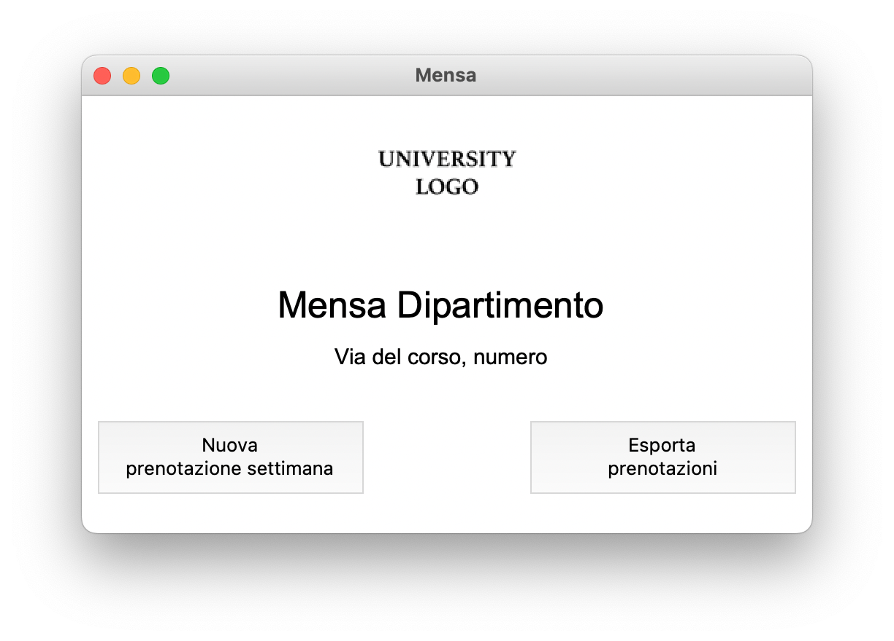

# University canteen reservation
Python project that allows to reserve food in the university canteen for a week.

The menu of the week is a `json` file located in [src/menu.json](src/menu.json).

Tested with `Python 3.9.2` and `Pillow==9.4.0` on MacOSx.

## Getting Started 
```bash
$ git clone https://github.com/mgranchelli/university-canteen-reservations.git
$ cd ./university-canteen-reservations
$ pip install -r requirements.txt
```

## Basic Usage
```bash
$ python3 mensa-interface.py
```



```bash
$ python3 mensa-terminal.py
```